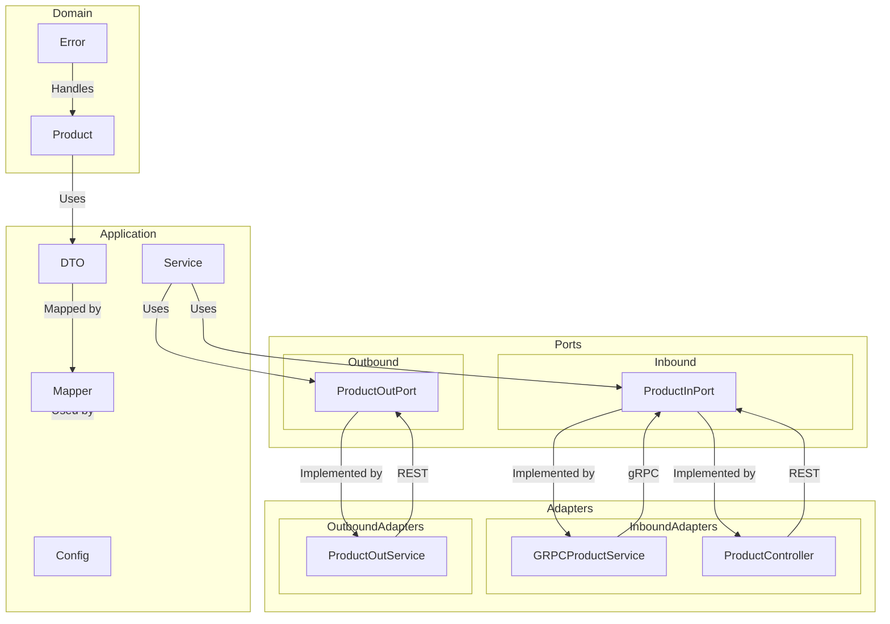

# between-spring-boot-products-api-test

## Description

This project is a Spring Boot-based application that exposes product information through REST and gRPC APIs.
It demonstrates a clean architecture following the Hexagonal Architecture pattern, allowing easy testing and
flexibility.
The service provides endpoints to retrieve product details and similar product IDs.

## Architecture

The architecture used in this project is **Hexagonal Architecture** (also known as Ports and Adapters).
The structure is divided into different layers:

### Adapters

Adapters are responsible for interacting with external systems and frameworks. In this project, we have:

- Inbound Adapters (receiving input):
    - `ProductController` (inside `adapter.in.rest`): Manages RESTful API requests.
    - `GRPCProductService` (inside `adapter.in.grpc`): Handles gRPC requests.
- Outbound Adapters (sending output):
    - `ProductOutService` (inside `adapter.out.rest`): Calls external REST services.

### Application Layer

This layer contains business logic and service orchestration:

- `config`: Configuration files.
- `dto`: Data Transfer Objects (DTOs) used for communication between layers.
- `service`: Contains service classes that implement the application's business logic.

### Domain Layer

The core of the system, defining business entities and rules:

- `product`: Contains product-related domain models.
- `error`: Handles domain-specific errors.

### Ports

Ports define the interfaces for communication between the core domain and adapters. In this project, we have:

- `Inbound Ports` (used by adapters to interact with the application):
    - `ProductInPort` (inside `port.in.rest`): Defines REST-based interactions.
- `Outbound Ports` (used by the application to communicate with external services):
    - `ProductOutPort` (inside `port.out.rest`): Defines interactions with external REST services.

### Diagram

Below is a diagram illustrating the Hexagonal Architecture used in this project:



## Features

- **REST API**: Exposes product details and similar product IDs.
- **gRPC API**: Exposes the same functionalities as the REST API but through a gRPC interface.
- **Resilience4j**: Circuit breakers, retries, and rate limiting are applied to ensure system resilience.
- **Caching**: Product data is cached to improve performance.
- **Timeouts and Retries**: Configured for handling time-sensitive requests.

## Requirements

- **Java 21** or later
- **Docker** (for containerized environment)
- **Maven** for building the project

## Running the Application (Local)

To run the application locally, follow these steps:

1. Clone the repository:
   ```bash
   git clone https://github.com/edeldelgado90/between-spring-boot-products-api-test.git
   cd between-spring-boot-products-api-test
   ```
2. Set Up Dependency Containers

   Follow the steps in
   the [backendDevTest repository](https://github.com/dalogax/backendDevTest?tab=readme-ov-file#testing-and-self-evaluation)
   to set up and run the required dependency containers.

3. Configure Environment Variables

   Check the .env file and ensure the PRODUCT_API_BASE_URL variable is set correctly. For local development, set it to:
   ```dotenv
   PRODUCT_API_BASE_URL=http://localhost:3001
   ```

4. Run the application:

```
mvn spring-boot:run
```

The application will start and be accessible at http://localhost:5000.

## Running the Application (Docker)

To run the application using Docker, follow these steps:

1. Clone the repository:
   ```bash
   git clone https://github.com/edeldelgado90/between-spring-boot-products-api-test.git
   cd between-spring-boot-products-api-test
   ```
2. Set Up Dependency Containers

   Follow the steps in
   the [backendDevTest repository](https://github.com/dalogax/backendDevTest?tab=readme-ov-file#testing-and-self-evaluation)
   to set up and run the required dependency containers.

3. Configure Network for External Containers

   Ensure that the external containers (like `simulado`) are connected to the Docker network named
   `backenddevtest_default`.
   This network is required for the application to communicate with the dependency containers.
   If you are using a different network name, update the `docker-compose.yml` file in this project to match the correct
   network name.

4. Configure Environment Variables

   Check the .env file and ensure the PRODUCT_API_BASE_URL variable is set correctly. For Docker development, set it to:
   ```dotenv
   PRODUCT_API_BASE_URL=http://simulado:80
   ```

5. Build and run the Docker container:

  ```bash
  docker-compose up --build
  ```

Once the container is running, the application will be available at: http://localhost:5000.

## Accessing the OpenAPI Documentation

Once the application is running, you can access the OpenAPI documentation at:

- URL: http://localhost:5000/swagger-ui.html
  This page allows you to interact with the REST API, view available endpoints, and try them out directly from the
  browser.

## REST API Endpoints

Here are the available REST API endpoints with example curl commands to access them:

### Get Similar Products

Endpoint: GET /product/{productId}/detail

```bash
curl -X GET "http://localhost:5000/product/1/detail" -H "accept: application/json"
````

## gRPC Usage

To interact with the gRPC service, you can use `grpcurl`. Below are examples of how to access the gRPC endpoints.

### Get Product Details

```bash
grpcurl -plaintext -d '{"productId": 1}' localhost:9090 product.ProductService/getSimilarProducts
```
